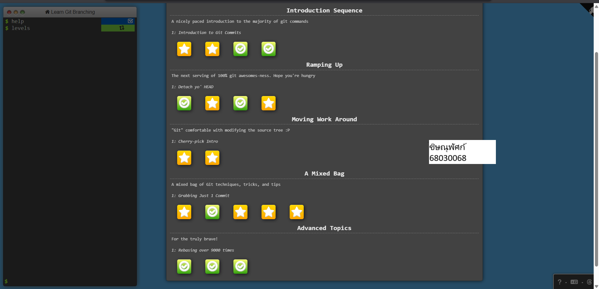

# ส่งงาน 68030063 ชิษณุพัศก์ 

## ข้อ 1 

## ข้อ 2 

## ข้อ 3 

## ข้อ 4 

## ข้อ 5 
 

## ข้อ 6

## ข้อ 7

## ข้อ 8

## ข้อ 9

## ข้อ 10

## ข้อ 11

## ข้อ 12 

## ข้อ 13

## ข้อ 14

## ข้อ 15

## ข้อ 16

## ข้อ 17

## ข้อ 18
